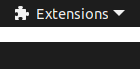

## Remove App Menu GNOME Extension
  - Remove the application menu from the top bar in GNOME
  - Updated version of the [original](https://github.com/rastersoft/remove_app_menu)

## Create an extension bundle:
  - `gnome-extensions pack ../remove-app-menu`

## Install the extension bundle:
 - `gnome-extensions install RemoveAppMenu@Dragon8oy.com.shell-extension.zip`
 - Reload GNOME
 - Enable the extension

### Screenshot:

